# Project overview
In this project, we use data from the [Waymo Open dataset](https://waymo.com/open/) in order to create a convolutional neural network to detect  and classify  objects. This is done by following steps such as data acquisition and processing, Exploratory data analysis(EDA) , cross validation, Data augmentation and creation of animations. 

Here is the [link](https://github.com/BarisKaragaac/tensor_flow) to this project's repository

# Instructions
## Requirements

* NVIDIA GPU with the latest driver installed
* docker / nvidia-docker

## Build
Build the image with:
```
docker build -t project-dev -f Dockerfile.gpu .
```

Create a container with:
```
docker run -v <PATH TO LOCAL PROJECT FOLDER>:/app/project/ -ti project-dev bash
```
and any other flag you find useful to your system (eg, `--shm-size`).

## Set up

Once in container, you will need to install gsutil, which you can easily do by running:
```
curl https://sdk.cloud.google.com | bash
```

Once gsutil is installed and added to your path, you can auth using:
```
gcloud auth login
```
 download the [Pretrained model](http://download.tensorflow.org/models/object_detection/tf2/20200711/ssd_resnet50_v1_fpn_640x640_coco17_tpu-8.tar.gz) and extract it in the ```training/pretrained-models/``` directory of the project
## Debug
* Follow this [tutorial](https://tensorflow-object-detection-api-tutorial.readthedocs.io/en/latest/install.html#tensorflow-object-detection-api-installation) if you run into any issue with the installation of the
tf object detection api

### Structure

*project_folder/build/*
- Dockerfile.gpu: The docker file used to build the projet's docker image.
- README.md: contains instructions for the project setup.
- requirements.txt: contains the dependencies to be installed with the docker image.

*project_folder/experiments*
- exporter_main_v2.py: This file is used to create an inference model
- model_main_tf2.py: This file is used to launch training

*project_folder/training/pretrained-models/*
- This folder contains the checkpoints of the pretrained models.

*project_folder/*
- create_splits.py: Creates the test, val and train folders and partions the datasets into them.
- download_process.py: Downloads data sets from Waymo Open Dataset and processes them into acceptavble format.
- edit_config.py: this file is used to generate configuration files used for model training.
- Exploratory Data Analysis.ipynb: Used to analyse the image and annotation data by displaying them.
- Explore augmentations.ipynb: Used to test various augmentation methods.
- filenames.txt: contains the file names of the data sets to be downloaded.
- inference_video.py: This file is used to generate animation videos of our model's inference for any tf record file.
- label_map.pbtxt: Contains the defined object classes
- pipeline_new.config: The training configuration file.

### Dataset
#### Dataset analysis
After exploring the dataset the following analysis where made

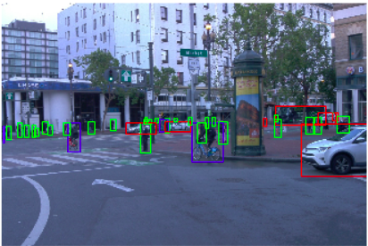

- It can be seen from the image above that the image was taken in town and contains a vehicles, pedestrians and a cyclist.
- Some objects are close enough to the camera while other are very far away and almost can't be seen with the human eye.


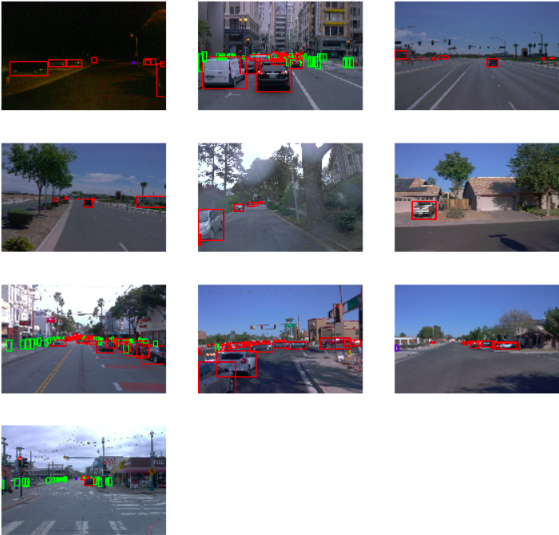

- Some images do not contain all the class objects, some only have cars, some have cars and pedestrians only.
- Mean while in some images the environment is bright and the lighing is clear enough, in some other images where taken at night and the environement is quit dark as well as due to climate changes some images are blured by fog.
- The overall class Overall, there are more cars that pedestrians and cyclists.
- Images are taken in town , hightways etc.
- Some Images are taken during the day, some at night, some are blured due to fog or darkness.

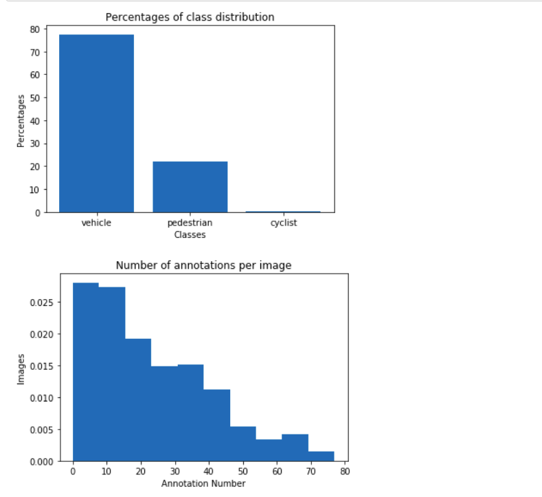
- Here we have the charts for the object distribution and Number of annotations per images.
- This show that the images contain a higher number of vehicles than pedestrians and cyclists so the class distribution is not balanced.
- We can see from these charts that the images contain a higer number of vehicles that pedestrians and cyclists, where cyclists are the least numerous objects.
- The chart of number of annotations per images demonstrates that there is a higher number of images that contain between o to 10 annotations than any other. And images with a high numder of annotations are the least numbered.


#### Cross validation
- Here the cross validation strategy is to randomly split the dataset into three partitions for trainign test and evaluation in the ration 8:1:1 or percentages 80%,10% and 10%. This because the training set need to be large enough in such a way that the model gets well trained because from the results of the analysis, we can see that the percentage of cyclist objects per images is very low so if the training data is no much the model might not be well trained to recognise cyclists.
- It can also be seen that the climate and brightness can change from image to image so the training data should be large enough for the model to be able to recognize object classes in any kind of image.

- The dataset is shuffled in order to ensure that images taken from different trips are evenly distributed amongs the train, eval and test partitions.

### Training 
#### Reference experiment

After monitoring the training through the tensorboard, the following was discoverd.


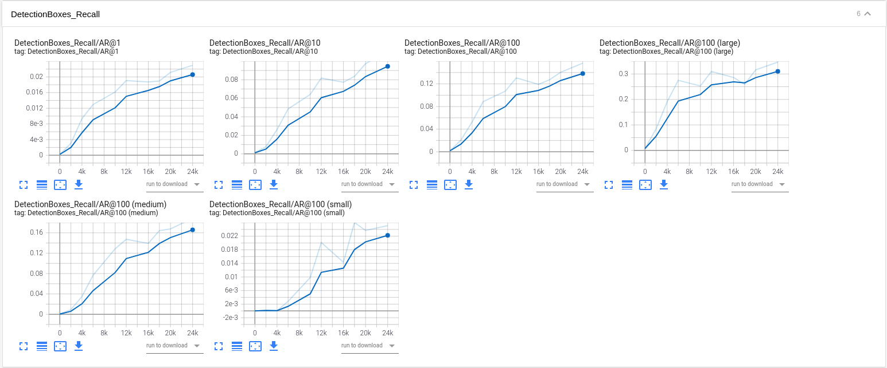
- From the precision charts we can see that the Detection boxes mean average precision is quite low. As the training goes on, the precision of object detection boxes also increases but the overall precision remains low.
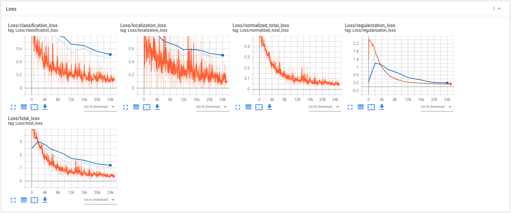
- Here validation loss is higher that training loss. This shows that there is some over fitting in the data set though it is not that much. THis behaviour was expected and it it should be enhanced with data augmentstion which will give a better recognition of unkonwn data to the model.


#### Improve on the reference

Since images where taken from different places having different climatic conditions and which are differently lit, the data augmentation options which would yield the best results are those that provide some variation in the captured environment like scallin up up and down, changing the color, contrast, brigthness and intensity in order the permit the model to detect objects from environments with any type of climate and bightness.
The Augmentation options chosen here are;
-  random_image_scale:
    Since there are cases where the vehicles can vbe close enough to the camera or too far from in, this augmentation was chosen in order to simulate that by randomly enlarging or minimizing images. This should enhance the training. 

- random_horizontal_flip:
    This flips the position of objects in images this will help to better train the model to recognize objects from any direction.

- random_rgb_to_gray:
    This augmentation is used so the the model can better recognize objects even in the dark or in zones where the view is blured due to fog.
- random_adjust_brightness:
    THis randomly adjusts the brigthness of the images and enhances the object recognition of the model in daylight or in the night in torch light.
- random_adjust_contrast:
    This modifies the contrast of the images to make it more dark and trains the model to recognize images in dart climates.
- random_distort_color:
    With image colors randomly distorted, the model will better recognize vehicles with any typre of paint, and it will also enhance image recognition when moving at high speed.
 
 Bellow are some images illustrating the result of these augmentations.
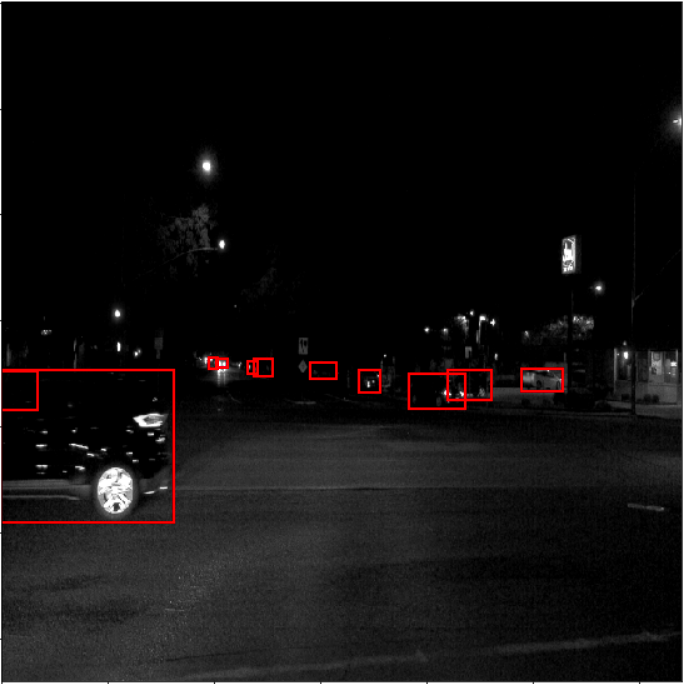
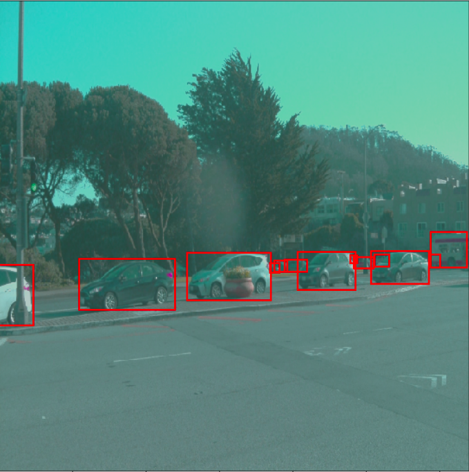
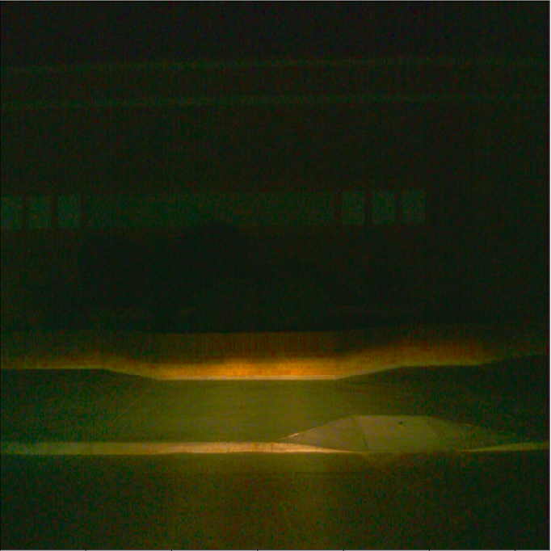
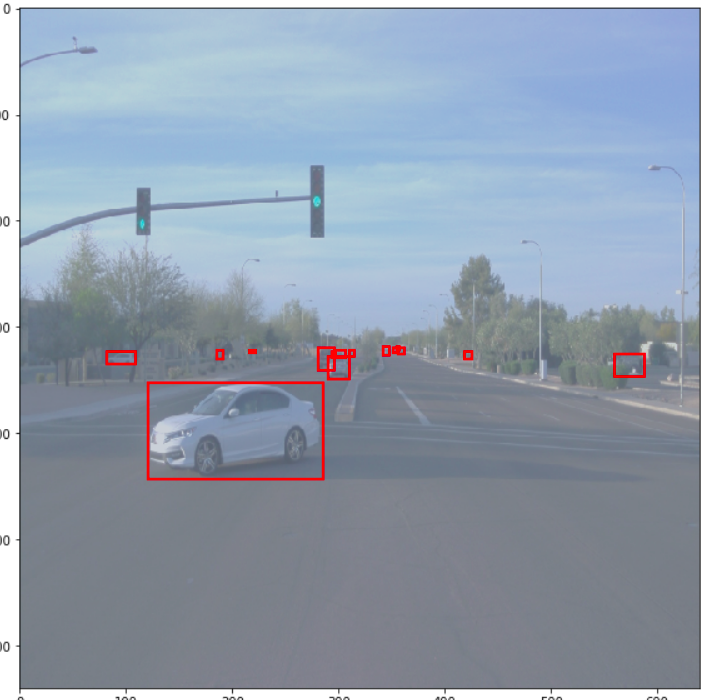
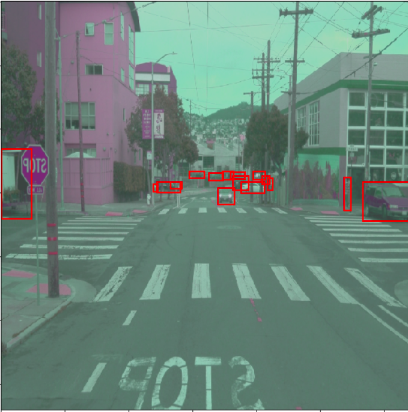
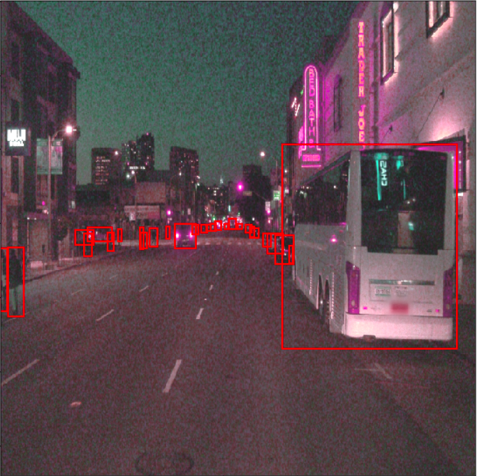

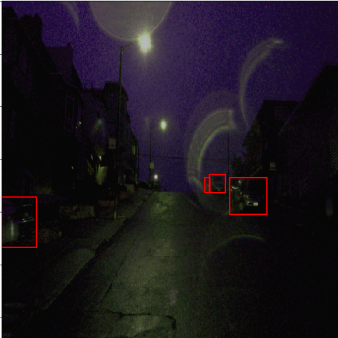


Throught the different optimizers which could be used here like Mini batch, Momentum and AdaGrad and RMSSProp, the best fit  which is used here is [Adam optimizer](https://www.tensorflow.org/api_docs/python/tf/compat/v1/train/AdamOptimizer). 
- The total steps where increased to 30000. 
- The warmup steps where increased to 2500.

    This will make the training more effitient.

The architecture [resnet152](https://hub.tensorflow.google.cn/tensorflow/retinanet/resnet152_v1_fpn_640x640/1) could be used but finally resnet50 was retained.


After running the training with these augmentations appplied, it can be seen from the new loss chart that the model is not more over feeting since the evaluation and training loss are now at the same level in total loss.
 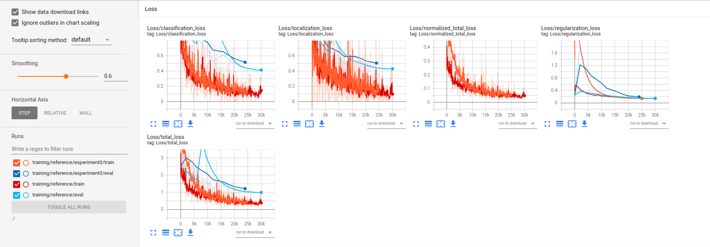

    The video animation.mp4 demonstrates the working of this model in real life situations. 